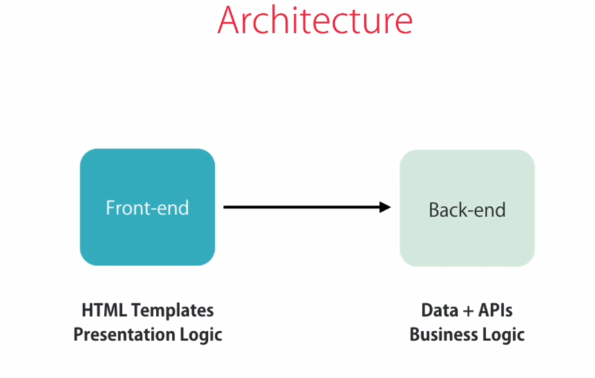
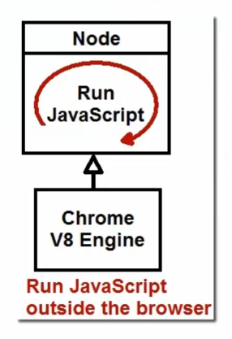
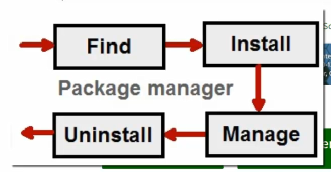
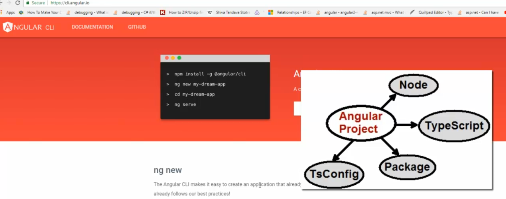

# Angular Exploring

I am a java developer who used to avoid task that relates to presentation layer, except `JavaFx`. However, witnessing the growing demmand on those who can do both `back-end` and `front-end` at the same time, I think like or dislike, I need to be more flexible to stay relevant with the market, or even during day to day project. Nowadays, from the business point of view, having developer with broader knowledge, from back-end to front-end, not only reduce the cost, but also make it more efficient, for example, remove dependencies between the one who knows the front-end will depend on back-end. For an innovation project, which involves the end UI, means, having a developer who knows both, will make the process of backend, frontend, integration and e2e testing more quick, which is aligned with agile spirit. I would like to tell whoever, feels intimidating with the Angular stuffs, you are not alone !!!. Having Typescipt with part of the Angular, feels, myself at home when coding Angular. This should be the same for you as well. Lets the journey with Angular world be fun and enjoyable. !!!!

## Overview

Angular is a framework for building client applications in HTML,CSS, and JavaScript / TypeScript which addresses challanges faced in the past (before Angular was invented), such as,

- gives application with clean structure
- includes a lot of re-usable code
- makes our applications more testable

Just a remainder, at high level view, the application's `Architecture`, most of the time if not always, is involving `front-end` and `back-end`.



As what we understand, when working with Angular, the scope will be `front-end`.

## Requirement

There are a couple of things needed before we can start coding with Angular,

`node`

> Without node, the angular is not possible.



Basically is to run the javascript outside the browser

`npm a.k.a Node Package Manager`

A tool to resolve the dependencies for a node project, for a given package meta-data.

It works like this, Just tell me the name of that package I will hunt it



> This is for javascript, means hunting the javascript package

```text
>npm

Usage: npm <command>

where <command> is one of:
    access, adduser, audit, bin, bugs, c, cache, ci, cit,
    clean-install, clean-install-test, completion, config,
    create, ddp, dedupe, deprecate, dist-tag, docs, doctor,
    edit, explore, fund, get, help, help-search, hook, i, init,
    install, install-ci-test, install-test, it, link, list, ln,
    login, logout, ls, org, outdated, owner, pack, ping, prefix,
    profile, prune, publish, rb, rebuild, repo, restart, root,
    run, run-script, s, se, search, set, shrinkwrap, star,
    stars, start, stop, t, team, test, token, tst, un,
    uninstall, unpublish, unstar, up, update, v, version, view,
    whoami

npm <command> -h  quick help on <command>
npm -l            display full usage info
npm help <term>   search for help on <term>
npm help npm      involved overview

Specify configs in the ini-formatted file:
    C:\Users\pmertaya\.npmrc
or on the command line via: npm <command> --key value
Config info can be viewed via: npm help config

npm@6.14.6 C:\apps\node-v12.18.3-win-x64\node_modules\npm
```

`Why need to learn node ?`

To understand node then it can be used for angular

Can I get the angular from npm?

```npm
npm install angular
```

> Getting Angular is Difficult and running the first application of angular is MORE DIFFUCULT
> How the dependencies of an angular project is organized like this,

```json
{
  "name": "mydumb-app",
  "version": "0.0.0",
  "scripts": {
    "ng": "ng",
    "start": "ng serve",
    "build": "ng build",
    "test": "ng test",
    "lint": "ng lint",
    "e2e": "ng e2e"
  },
  "private": true,
  "dependencies": {
    "@angular/animations": "~10.0.14",
    "@angular/common": "~10.0.14",
    "@angular/compiler": "~10.0.14",
    "@angular/core": "~10.0.14",
    "@angular/forms": "~10.0.14",
    "@angular/platform-browser": "~10.0.14",
    "@angular/platform-browser-dynamic": "~10.0.14",
    "@angular/router": "~10.0.14",
    "rxjs": "~6.5.5",
    "tslib": "^2.0.0",
    "zone.js": "~0.10.3"
  },
  "devDependencies": {
    "@angular-devkit/build-angular": "~0.1000.8",
    "@angular/cli": "~10.0.8",
    "@angular/compiler-cli": "~10.0.14",
    "@types/node": "^12.11.1",
    "@types/jasmine": "~3.5.0",
    "@types/jasminewd2": "~2.0.3",
    "codelyzer": "^6.0.0",
    "jasmine-core": "~3.5.0",
    "jasmine-spec-reporter": "~5.0.0",
    "karma": "~5.0.0",
    "karma-chrome-launcher": "~3.1.0",
    "karma-coverage-istanbul-reporter": "~3.0.2",
    "karma-jasmine": "~3.3.0",
    "karma-jasmine-html-reporter": "^1.5.0",
    "protractor": "~7.0.0",
    "ts-node": "~8.3.0",
    "tslint": "~6.1.0",
    "typescript": "~3.9.5"
  }
}
```

For that, there is angular cli



## Angular and Typescript

`Angular CLI`

```text
ng --version

     _                      _                 ____ _     ___
    / \   _ __   __ _ _   _| | __ _ _ __     / ___| |   |_ _|
   / △ \ | '_ \ / _` | | | | |/ _` | '__|   | |   | |    | |
  / ___ \| | | | (_| | |_| | | (_| | |      | |___| |___ | |
 /_/   \_\_| |_|\__, |\__,_|_|\__,_|_|       \____|_____|___|
                |___/


Angular CLI: 10.0.8
Node: 12.18.3
OS: win32 x64N
@angular-devkit/architect    0.1000.8
@angular-devkit/core         10.0.8
@angular-devkit/schematics   10.0.8
@schematics/angular          10.0.8
@schematics/update           0.1000.8
rxjs                         6.5.5
```

## First Project

```node
ng new my-first-project
cd my-first-project
ng serve

```

Browse `http://localhost:4200/`

`How it works`

main.ts load module app

```node
platformBrowserDynamic()
  .bootstrapModule(AppModule)
  .catch((err) => console.error(err));
```

Feature, Webpack

`Hot Module Replacement (HMR)`
`Webpack automatically inject style, etc into index.html`

`AngularJS (1.X)`

`Angular (2+) is Angular`

TypeScript

- Strong typing
- OO features
- Compile-time errors

`Type Script to Java Script`

```tsc
tsc main.ts
```

`let`, `var` is TypeScript

`let` will catch the compiler issue

Access modifier is `public` by default

## Building Block Angular App

`Component`

Encapsulates Data, HTML template and Logic to view

Every app has at least 1 module, app module.

Each module has some related components
How to apply?

- Create a component
- Register it in a module
- Add an element in an HTML markup

A building block is provided by the `ng cli` tool to ease the glue between element inside a component.
Component is reusable unit by which an html template markup applied into a given data to be presented in an expected way.

Take, presenting a list of authors.
|Author|Publication |Rating|
|--|--|--|
|Author 1| 10|23|
|Author 2| 10|15|
|Author 3| 15|30|

There are 3 things need to take care.

- decouple data provider with the data presenter so that, in case of angular unit testing scope is only testing the presenter layer, and the decoupling should be easy to do.
- how to render the data into html page?
- the changes to put the new use case should be isolated so that the impact on the existing feature is minimum

## Steps

`Create Service`

```bash
authors.service.spec.ts
authors.service.ts
```

Inspect the file
Create a model to represent the `Author` object

```typescript
export class Author {
  constructor(
    private _name: string,
    private _pub: number,
    private _rating: number
  ) {}

  get name() {
    return this._name;
  }
  get rating() {
    return this._rating;
  }
  get pub() {
    return this._pub;
  }
}
```

> expose the properties, while keep the field private

On the `AuthorsService`, construct the list of Author.

```typescript
export class AuthorsService {
  // tslint:disable-next-line: variable-name
  private _authors: Author[];
  constructor() {
    // tslint:disable-next-line: variable-nam
    this._authors = [
      new Author("Jack Dowson", 10, 12),
      new Author("Edington", 15, 22),
      new Author("Jecko Kim", 11, 34),
    ];
  }

  // tslint:disable-next-line: typedef
  get authors() {
    return this._authors;
  }
}
```

The situation is the same here, where the field is kept as private while having properties to expose the array of Author.
That's all for the Service layer. In the real deployment this part is connecting to backend through http endpoint, `RESTfull` API for instance. Each service need to be registered as `provider` in the modules. Lets open `app.modules.ts` and check the `@NgModule` decorator.

```text
@NgModule({
  declarations: [
    AppComponent,
    AuthorsComponent,
  ],
  imports: [
    BrowserModule,
    FormsModule
  ],
  providers: [
  CoursesService,
  AuthorsService
  ],
  bootstrap: [AppComponent]
})
```

Somewhere in the component will need to use this class to get the data.

`Create Component`

```bash

```

The files are,

```folder
authors.component.css
authors.component.html
authors.component.spec.ts
authors.component.ts
```

Open the `authors.component.ts`.

```typescript
import { AuthorsService, Author } from "./../authors.service";
@Component({
  // tslint:disable-next-line: component-selector
  selector: "authors",
  templateUrl: "./authors.component.html",
  styleUrls: ["./authors.component.css"],
})
export class AuthorsComponent implements OnInit {
  authors: Author[];

  constructor(authorsService: AuthorsService) {
    this.authors = authorsService.authors;
  }

  ngOnInit(): void {}
}
```

The glue is on the constructor of `AuthorsComponent`. The instantiation of `AuthorsService` happens through `Dependency Injection`.

Look at the `Component` decorator. The selector determines what HTML markup (tag) to render the component into browser. In this case, `<authors></authors>`.
Where is the logic of `<authors></authors>`? It is in `authors.component.html`. Lets open this file,

```html
<h1>{{ authors.length }} Authors</h1>

<table>
  <tr>
    <th>Name</th>
    <th>Publication</th>
    <th>Rating</th>
  </tr>
  <tr *ngFor="let author of authors">
    <td>{{ author.name }}</td>
    <td>{{ author.pub }}</td>
    <td>{{ author.rating }}</td>
  </tr>
</table>
```

So, the number author is rendered as simply a text under `<h1>`, while the detail of `Author` is rendered as record under a table.
The last step is updating the `app.component.html` to render the new tag. Add the `<authors></authors>` as below

```html
<h1>Angular</h1>
<authors></authors>
```

That's it.
